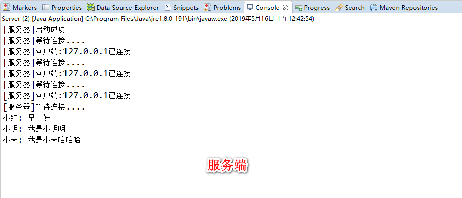
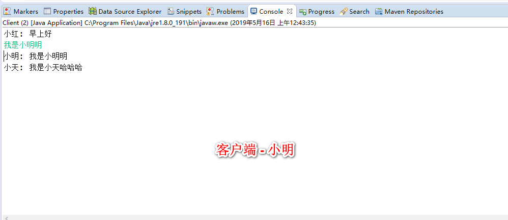
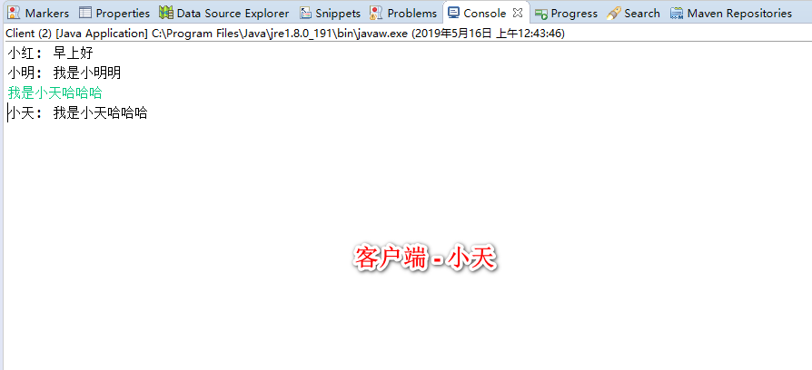

socket也叫套接字, 是为了方便程序员进行网络开发而被设计出来的编程接口. socket在七层模型中是应该属于传输层(TCP,UDP协议)之上
的一个抽象接口.


### OSI七层模型
> 应用层

```
网络服务与最终用户的一个接口。
协议有：HTTP FTP TFTP SMTP SNMP DNS TELNET HTTPS POP3 DHCP
```
> 表示层

```
数据的表示、安全、压缩。（在五层模型里面已经合并到了应用层）
格式有，JPEG、ASCll、DECOIC、加密格式等
```
> 会话层

```
建立、管理、终止会话。（在五层模型里面已经合并到了应用层）
对应主机进程，指本地主机与远程主机正在进行的会话
```
> 传输层

```
定义传输数据的协议端口号，以及流控和差错校验。
协议有：TCP UDP，数据包一旦离开网卡即进入网络传输层
```
> 网络层

```
进行逻辑地址寻址，实现不同网络之间的路径选择。
协议有：ICMP IGMP IP（IPV4 IPV6） ARP RARP
```
> 数据链路层

```
建立逻辑连接、进行硬件地址寻址、差错校验 [2]  等功能。（由底层网络定义协议）
将比特组合成字节进而组合成帧，用MAC地址访问介质，错误发现但不能纠正。
```
> 物理层

```
建立、维护、断开物理连接。（由底层网络定义协议）
```
从上面的七层模型中我们可以知道建立socket连接是需要IP地址和端口号的, 好了, 废话不多说, 直接进入代码环节.

## (待完成) 解释socket的接口

## (待完成) 先写简单socket的demo来解释阻塞式IO, 才能更好的理解为什么后面需要用到多线程实现多客户端同时连接
~~

---

## 实现简单聊天室功能
### 聊天室服务端
设计: 一个线程在不断的accept新客户端的连接, 每收到一个客户端连接就起一个线程来监听该客户端的输入流,
 并记录该向客户的out流到listeners中, 当收到信息时广播到所有客户端out流中

代码:
Server.java
```java
package socket.chatroom;

import java.io.IOException;
import java.io.InputStream;
import java.io.OutputStream;
import java.net.ServerSocket;
import java.net.Socket;
import java.util.ArrayList;
import java.util.List;
import java.util.Scanner;

/**
 * 服务器, 这里需要一直在accept, 所以监听输入流的工作就交给另一个线程
 * @author Kenny
 *
 */
public class Server {

	static List<OutputStream> listeners = new ArrayList<>(16); 
	static final int PORT = 10000;

	public static void main(String[] args) {
		Server server = new Server();
		server.startServer();
	}

	private void startServer() {
		try (
			ServerSocket server = new ServerSocket(PORT);
		){
			System.out.println("[服务器]启动成功");
			
			while (true) {
				System.out.println("[服务器]等待连接....");
				try { 
					// 阻塞直到有客户端连接过来
					Socket socket = server.accept();
					System.out.println("[服务器]客户端:" + socket.getInetAddress().getHostAddress()
							+ "已连接");
					
					handle(socket);
					
				} catch (Exception e) {
					System.out.println("[异常]连接中断:" + e.getMessage());
				}
			}
		} catch (Exception e) {
			e.printStackTrace();
		} 
		
	}
	
	/**
	 * 处理socket,多线程监听客户端输入流
	 * @param scanner
	 * @param socket
	 * @throws IOException
	 */
	private void handle(Socket socket) throws IOException {
		InputStream in = socket.getInputStream();
		OutputStream out = socket.getOutputStream();
		
		// 将客户倾听者注册到广播列表里
		addListener(out);
		
		// 监听客户端发来的消息的线程, 收到客户端消息时, 广播出去
		new Thread(new ServerReadThread(in, out, this)).start();
	}
	
	/**
	 * ArrayList是线程非安全的, 多线程下操作要注意
	 * @param out
	 */
	public synchronized void addListener(OutputStream out) {
		this.listeners.add(out);
	}
	
	public synchronized void removeListener(OutputStream out) {
		this.listeners.remove(out);
	}

	/**
	 * 推送消息
	 * @param message
	 */
	public synchronized void push(String message) {
		listeners.forEach(out -> {
			try {
				out.write(message.getBytes());
				out.flush();
			} catch (IOException e) {
				e.printStackTrace();
			}
		});
	}
	
}

```

ServerReadThread.java
```java
package socket.chatroom;

import java.io.IOException;
import java.io.InputStream;
import java.io.OutputStream;

/**
 * 客户端读广播的线程
 * @author Kenny
 *
 */
class ServerReadThread implements Runnable {
	
	private InputStream in;		// 客户端向服务器的输入流
	private OutputStream out;	// 向客户端的输出流, 保存该对象是为了IO结束时关闭out并从server.listener中删除
	private Server server;		// 服务器
	
	public ServerReadThread(InputStream in, OutputStream out, Server server) {
		this.in = in;
		this.server = server;
	}

	@Override
	public void run() {
		try (
			InputStream in = this.in;
		) {
			byte[] buffer = new byte[1024];
			int len = -1;
			while ((len = in.read(buffer)) != -1) {
				// 读信息
				String message = new String(buffer, 0, len);
				System.out.println(message);
				
				// 广播消息
				server.push(message);
			}
		} catch (IOException e) {
			e.printStackTrace();
		} finally {
			// IO结束, 关闭out, 从server中清除该out
			try {
				if (out != null)
					out.close();
			} catch (IOException e) {
				e.printStackTrace();
			}
			server.removeListener(out);
		}
	}
	
}
```

### 聊天室客户端
设计: 主线程监听Scanner输入流, 并向服务器发送数据, 另起一个线程监听服务器向客户端的输入流
Client.java
```java
package socket.chatroom;

import java.io.IOException;
import java.io.InputStream;
import java.io.OutputStream;
import java.net.Socket;
import java.util.Scanner;

/**
 * 简单socket客户端demo
 * @author Kenny
 *
 */
public class Client {
	
	private String name;

	public Client(String name) {
		this.name = name;
	}
	
	public static void main(String[] args) {
		Client client = new Client("小红");
		client.connect();
	}
	
	private void connect() {
		try (
			Scanner scanner = new Scanner(System.in);
			Socket socket = new Socket("127.0.0.1", Server.PORT);
				
			OutputStream out = socket.getOutputStream();
			InputStream in = socket.getInputStream();
		) {
		
			handle(scanner, in, out);
			
		} catch (IOException e) {
			e.printStackTrace();
		}
	}

	/**
	 * 主线程监听客户输入信息,并发送给服务端, 另起一个线程监听服务端发来的信息
	 * @param scanner	扫描客户窗口输入信息
	 * @param in		服务端向客户端的输入流
	 * @param out		客户端向服务端的输出流,scanner扫描到的信息将会写到out里
	 * @throws IOException
	 */
	private void handle(Scanner scanner, InputStream in, OutputStream out) throws IOException {
		new Thread(new ClientReadThread(in)).start();
		
		while (scanner.hasNextLine()) {
			// 写信息
			String message = scanner.nextLine();
			message = name + ": " + message;
			out.write(message.getBytes());
			out.flush();
		}
	}
}

```

ClientReadThread.java
```java
package socket.chatroom;

import java.io.IOException;
import java.io.InputStream;

/**
 * 客户端读广播的线程
 * @author Kenny
 *
 */
class ClientReadThread implements Runnable {
	
	private InputStream in;		// 服务器向客户端的输入流
	
	public ClientReadThread(InputStream in) {
		this.in = in;
	}

	@Override
	public void run() {
		try (
			InputStream in = this.in;
		) {
			byte[] buffer = new byte[1024];
			int len = -1;
			while ((len = in.read(buffer)) != -1) {
				// 读信息
				String message = new String(buffer, 0, len);
				System.out.println(message);
			}
		} catch (IOException e) {
			e.printStackTrace();
		}
	}
	
}
```


### 运行结果




